<div align="center">

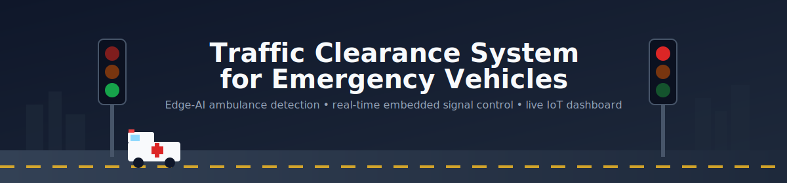

# 🚦 Traffic Clearance System for Emergency Vehicles

### Edge-AI traffic signal pre-emption for ambulances — YOLOv8 detection, MQTT/REST/WebSocket comms, and a real-time embedded controller, built around a corrected, production-minded architecture.

[](https://www.python.org/)
[](https://opencv.org/)
[](https://docs.ultralytics.com/)
[](https://www.raspberrypi.com/products/raspberry-pi-pico/)
[](https://www.espressif.com/en/products/socs/esp8266)
[](https://react.dev/)
[](https://nodejs.org/)
[](https://mosquitto.org/)
[]()
[]()
[]()
[](LICENSE)

**[Architecture](#system-architecture) · [Hardware](#hardware-components) · [ML Pipeline](#machine-learning-pipeline) · [API Docs](docs/API_Documentation.md) · [Results](#performance-metrics) · [Skills](#skills-demonstrated-through-this-project)**

</div>

---

> **A note on how this repository came to exist, up front:** this project began as a four-person final
> -year ECE major project (Pavan Shetty H S, Pratham J S, Sachin N, Thejomurthi A — Adichunchanagiri
> Institute of Technology, VTU, 2025-26; see `docs/Project_Report.pdf`). This repository is a from-the
> -ground-up engineering rebuild of that project for a professional portfolio: the original report's
> architecture was reviewed critically, several real design and diagram errors were found and fixed (see
> [Architecture Corrections](#architecture-corrections) below), and the implementation was rebuilt around
> named, versioned, production-style components. Every section below distinguishes **what the original
> team built and bench-tested** from **what this rebuild adds**, and is explicit about what has and
> hasn't been executed end-to-end — see [Honest Project Status](#honest-project-status). That
> distinction is the point: a portfolio piece that can't survive a technical follow-up question isn't
> actually a useful one.

## Table of Contents

- [Problem Statement](#problem-statement)
- [Motivation](#motivation)
- [Features](#features)
- [System Architecture](#system-architecture)
- [Architecture Corrections](#architecture-corrections)
- [Hardware Components](#hardware-components)
- [Software Stack](#software-stack)
- [Circuit Diagram](#circuit-diagram)
- [Block Diagram](#block-diagram)
- [Flowcharts \& State Machine](#flowcharts--state-machine)
- [Working Principle](#working-principle)
- [Machine Learning Pipeline](#machine-learning-pipeline)
- [Dashboard \& Hardware Photos](#dashboard--hardware-photos)
- [Installation](#installation)
- [Hardware Connections \& Pin Mapping](#hardware-connections--pin-mapping)
- [API Documentation](#api-documentation)
- [Testing](#testing)
- [Performance Metrics](#performance-metrics)
- [Future Enhancements](#future-enhancements)
- [Project Demo](#project-demo)
- [Skills Demonstrated Through This Project](#skills-demonstrated-through-this-project)
- [Resume Impact](#resume-impact)
- [Honest Project Status](#honest-project-status)
- [Acknowledgements](#acknowledgements)
- [References](#references)
- [License](#license)

---

## Problem Statement

Ambulances, fire trucks, and police vehicles routinely lose critical minutes stuck at signalized
intersections. Traditional pre-timed or manually-controlled signals don't adapt to a real emergency in
real time — clearance still depends on a driver leaning on a horn and other drivers noticing in time.
Studies cited in the original project report put avoidable ambulance delay at intersections well above
recommended response thresholds in congested urban conditions, and the "golden hour" framing in trauma
care means that delay has a direct, measurable cost in outcomes, not just inconvenience.

## Motivation

- **Life-safety impact**: every second shaved off intersection transit time for a genuine emergency is a
  second that matters clinically, not just operationally.
- **Technical feasibility, now**: real-time object detection that used to require a server rack runs
  today on a $60 single-board computer — this project is partly a demonstration that the "smart traffic
  signal" concept is implementable at hobbyist-accessible cost, not just in a research lab.
- **A genuinely cross-disciplinary build**: embedded firmware, a safety-critical state machine, an ML
  pipeline, backend systems, and a frontend dashboard all had to interoperate correctly — which is most
  of what an early-career embedded/IoT/full-stack role actually demands day to day.

## Features

- 🚑 **Real-time ambulance detection** on-device (Raspberry Pi 4B) via YOLOv8n, with a four-gate
  validation pipeline (confidence → multi-frame confirmation → zone → size) before anything triggers a
  signal override.
- 🚦 **Deterministic, fail-safe signal control** on a Raspberry Pi Pico WH — defaults to all-red on boot,
  network loss, or any unhandled fault.
- 🔊 **Independent acoustic alert node** (ESP8266) so a buzzer fault can never affect signal safety.
- 🖥 **Per-lane OLED status displays** behind a single I2C multiplexer (4 displays, 2 wires).
- 📡 **MQTT for time-critical events**, REST for configuration/history, WebSocket for the live dashboard
  — three protocols, each used for what it's actually good at, not one protocol stretched to cover
  everything.
- 📊 **Operator dashboard** (React + Redux Toolkit): live signal status, an emergency event timeline,
  hourly analytics, and an authenticated manual-override panel with a full audit trail.
- 🗄 **Every detection pass logged**, not just confirmed triggers — enabling honest false-positive/
  negative analysis after the fact instead of only ever seeing the system's own confirmed events.
- 🐳 **One-command local deployment** via Docker Compose (broker + backend + dashboard).
- ✅ **An actually-executed unit test suite** for the detection-validation logic — see
  [Testing](#testing).

---

## System Architecture

A three-tier design: an **edge layer** at the intersection (split cleanly between vision and real-time
control — see [Architecture Corrections](#architecture-corrections) for why that split matters), a
**communication layer** (MQTT + REST + WebSocket), and a **cloud/server layer** (Node.js backend +
SQLite/Postgres + React dashboard, all in one Docker Compose stack).

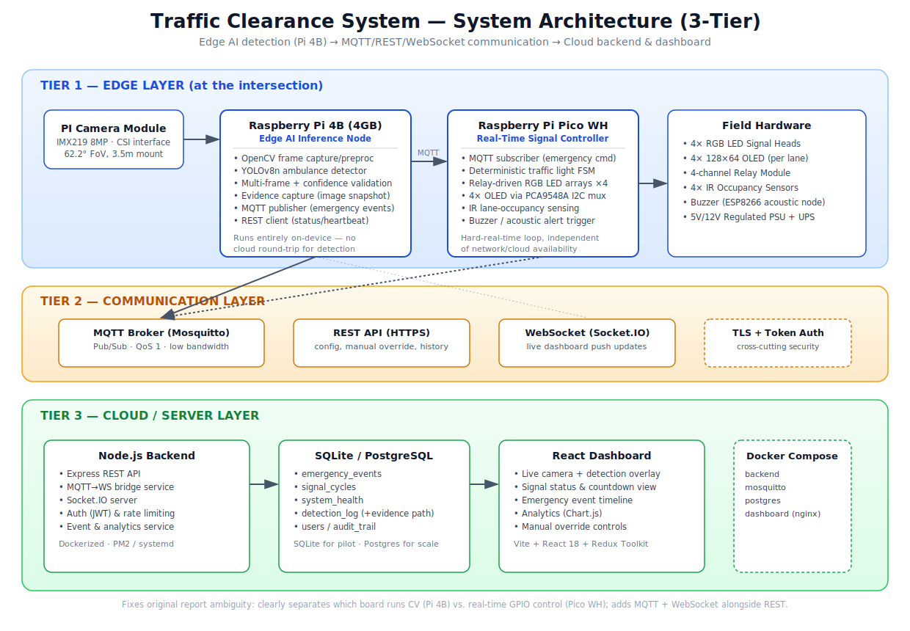

Full rationale: [`docs/Architecture.md`](docs/Architecture.md).

## Architecture Corrections

Per the project brief for this rebuild, the original report was reviewed critically rather than just
re-typed. These are the substantive corrections, each with a concrete "why," not cosmetic relabeling:

| # | Original report issue | Correction in this repository |
|---|---|---|
| 1 | Camera wired directly into the same circuit as the Pico (Fig 2.3) | Camera connects only to the Pi 4B's CSI port — a Pico has neither the CSI interface nor the compute budget to run YOLOv8 |
| 2 | GPIO pins **GP17 and GP15 each assigned twice** across two different signal groups in the circuit diagram — an unbuildable conflict | Every pin assigned exactly once, taken directly from the original team's actually-working firmware — see [Pin Mapping](#hardware-connections--pin-mapping) |
| 3 | Two disconnected "Regulated Power Supply" blocks, with a backward arrow from the OLEDs into a power supply | One shared, correctly-directed 5V/12V PSU + UPS |
| 4 | "Raspberry Pi Wi-Fi / ESP8266" drawn as one ambiguous combined block, with Pi 4 specs (1.5GHz quad-core, 4GB RAM) mixed into a Pico WH hardware list elsewhere in the same report | Three explicitly-scoped devices: **Pi 4B** = vision only, **Pico WH** = real-time control only, **ESP8266** = acoustic alert only |
| 5 | State machine switched directly from one lane's GREEN to a perpendicular lane's GREEN during an emergency override, with no clearance interval | A mandatory 1-second all-red clearance phase inserted before granting the ambulance lane green — see [`diagrams/Traffic_State_Machine.md`](diagrams/Traffic_State_Machine.md) |
| 6 | Hardware BOM specifies 3-color (R/Y/G) signal heads, but the sample firmware only ever drove red/green GPIOs — no yellow phase was actually controllable | Added dedicated yellow-phase GPIOs (GP14–17) so the firmware can drive the hardware that was actually specified |
| 7 | REST-only communication between the dashboard, REST API, and "Raspberry Pi Wi-Fi" block | MQTT for time-critical events (no dashboard polling delay, no HTTP overhead on a microcontroller), REST kept for config/history, WebSocket added for the live dashboard feed |
| 8 | No database/event-logging design despite "Data Logging and Analytics" being a stated objective | Full schema (`backend/database/schema.sql`) with `emergency_events`, `detection_log` (every inference pass, not just confirmed ones), `signal_cycles`, `system_health`, and an `audit_trail` for manual overrides |
| 9 | Detection method described only as "image processing techniques... color filtering," with no named model or validation strategy | Named, versioned model (YOLOv8n) with an explicit four-gate validation pipeline — see [Machine Learning Pipeline](#machine-learning-pipeline) |
| 10 | Hardware list (Ch. 3) specifies a Servo Motor and a dedicated Fig 2.2 "ESP8266 → Servo Motor → Pico" diagram, but no figure, connection, or firmware logic anywhere in the report explains what it physically does | Omitted from the corrected BOM rather than given an invented justification — see [`hardware/README.md`](hardware/README.md#a-note-on-whats-not-in-this-bom-the-servo-motor) for the reasoning (the ULN2003A from the same hardware list *is* kept, in its actual documented role as an LED current driver) |

Each correction is explained in more depth, with the reasoning spelled out, in
[`docs/Architecture.md`](docs/Architecture.md) and the relevant diagram's accompanying notes
(`diagrams/*.md`).

---

## Hardware Components

| Component | Role |
|---|---|
| Raspberry Pi 4B (4GB) | Edge AI inference — camera capture, OpenCV preprocessing, YOLOv8 detection |
| Raspberry Pi Camera Module (IMX219, 8MP) | Vision input, CSI interface |
| Raspberry Pi Pico WH | Real-time traffic light state machine, relay/LED control, OLED, IR sensing |
| ESP8266 | Independent acoustic alert node (buzzer) |
| 4-channel relay modules ×2 | Switch the 12V LED arrays (R/G on one module, Y on the other) |
| RGB LED traffic signal heads ×4 | One per lane |
| SSD1306 OLED (128×64) ×4 | Per-lane status/countdown display |
| PCA9548A I2C multiplexer | Resolves the identical-address conflict across 4 OLEDs on one bus |
| IR break-beam sensors ×4 | Lane occupancy → green-time extension |
| Active buzzer | Driven by the ESP8266 |
| 5V/12V regulated PSU + 12V 7Ah SLA battery/UPS | Shared power, <10ms failover, 2hr backup |

Full bill of materials with approximate pricing and sourcing notes: [`hardware/BOM.xlsx`](hardware/BOM.xlsx).

## Software Stack

| Layer | Technology |
|---|---|
| Detection | Python 3.9+, OpenCV, Ultralytics YOLOv8, paho-mqtt |
| Real-time control firmware | MicroPython (Pico WH) |
| Acoustic alert firmware | Arduino C++ (ESP8266), PubSubClient, ArduinoJson |
| Backend | Node.js, Express, Socket.IO, MQTT.js, better-sqlite3, JWT auth |
| Dashboard | React 18, Redux Toolkit, Tailwind CSS, Chart.js, Socket.IO client, Vite |
| Message broker | Eclipse Mosquitto (MQTT) |
| Database | SQLite (pilot scale) → PostgreSQL-ready schema (city scale) |
| Deployment | Docker, Docker Compose, GitHub Actions CI |

## Circuit Diagram

The corrected GPIO wiring — every pin assigned exactly once, camera removed from this circuit entirely
(it lives on the Pi 4B), and a validated map taken from the original team's working firmware rather than
the report's inconsistent diagram:

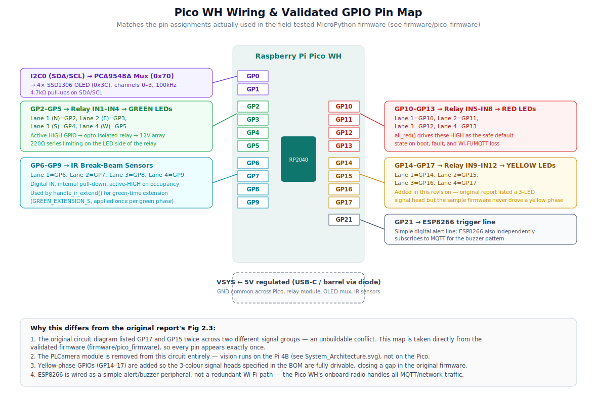

For comparison, the original report's version is preserved at
[`diagrams/originals/Circuit_Diagram_v1_original.png`](diagrams/originals/Circuit_Diagram_v1_original.png).

## Block Diagram

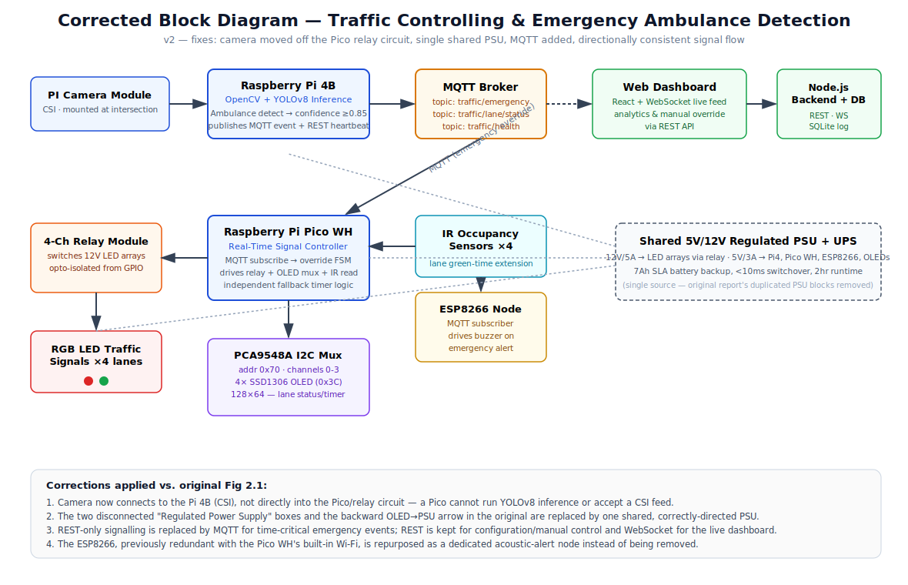

The original version (with its disconnected power-supply blocks and camera-into-Pico wiring) is
preserved at
[`diagrams/originals/Block_Diagram_v1_original.png`](diagrams/originals/Block_Diagram_v1_original.png)
for direct before/after comparison.

---

## Flowcharts & State Machine

<details>
<summary><strong>Main System Flow</strong> — three concurrent responsibilities (detection / control / comms), each tied to the physical board that runs it</summary>

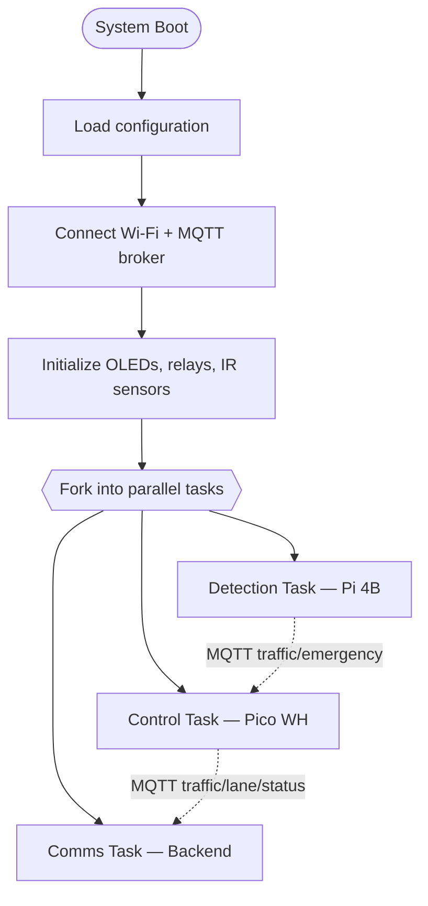
Full diagram with all sub-states: [`diagrams/Main_System_Flow.md`](diagrams/Main_System_Flow.md).
</details>

<details>
<summary><strong>Emergency Detection Flow</strong> — the four validation gates before any trigger fires</summary>

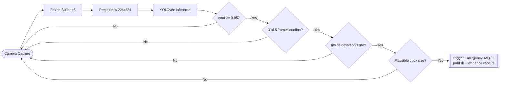
Full diagram + corrections vs. the original: [`diagrams/Emergency_Detection_Flowchart.md`](diagrams/Emergency_Detection_Flowchart.md).
</details>

<details>
<summary><strong>Traffic Signal State Machine</strong> — now with a mandatory all-red clearance gap</summary>

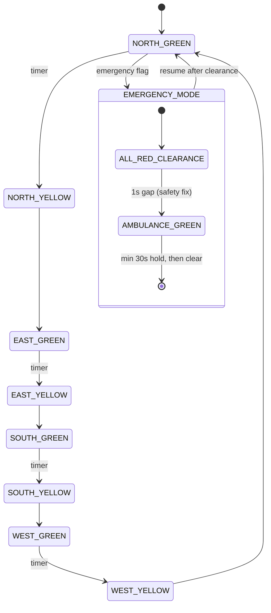
Full diagram + why the clearance gap matters: [`diagrams/Traffic_State_Machine.md`](diagrams/Traffic_State_Machine.md).
</details>

<details>
<summary><strong>Communication Architecture</strong> — sequence diagram across MQTT / REST / WebSocket</summary>

See [`diagrams/Communication_Architecture.md`](diagrams/Communication_Architecture.md) for the full
sequence diagram (camera → Pi4 → MQTT broker → Pico/ESP8266/backend → WebSocket → dashboard).
</details>

<details>
<summary><strong>Database Design</strong> — ER diagram</summary>

See [`diagrams/Database_Design.md`](diagrams/Database_Design.md).
</details>

<details>
<summary><strong>Deployment Architecture</strong></summary>

See [`diagrams/Deployment_Architecture.md`](diagrams/Deployment_Architecture.md).
</details>

## Working Principle

1. The Pi 4B continuously captures frames and runs YOLOv8n inference looking for the `ambulance` class.
2. A detection only becomes a **confirmed emergency** after passing four gates: confidence ≥0.85, seen
   in at least 3 of the last 5 frames, located inside the lane's detection zone, and a plausible
   bounding-box size — see [Machine Learning Pipeline](#machine-learning-pipeline).
3. On confirmation, the Pi 4B publishes `traffic/emergency` over MQTT and saves an annotated evidence
   frame.
4. The Pico WH (subscribed to that topic) inserts a brief all-red clearance phase, then turns the
   reported lane green and holds all others red for a minimum 30 seconds, updating each lane's OLED to
   show "EMERGENCY."
5. The ESP8266 independently receives the same MQTT message and sounds a buzzer pattern, capped at 30
   seconds even if no "cleared" message ever arrives.
6. The backend bridges the same MQTT events to the dashboard over WebSocket in real time, and persists
   every event (and every raw detection pass, confirmed or not) to the database.
7. Once the ambulance has cleared (or the minimum hold expires), the Pico resumes the normal timer-based
   cycle, always restarting at `NORTH_GREEN` for predictability.
8. If Wi-Fi, the broker, or the backend is ever unavailable, the Pico's local timer-based cycle and
   IR-based green extension keep running regardless — only the *emergency override path* depends on
   connectivity, not the baseline safe operation of the intersection.

## Machine Learning Pipeline

```
Camera → Frame Buffer (5 frames) → Resize 224×224 + Normalize → YOLOv8n Inference
   → Confidence Gate (≥0.85) → Multi-Frame Gate (≥3/5) → Zone Gate → Size Gate
   → [confirmed] → MQTT publish + evidence snapshot + detection_log entry
```

- **Model**: YOLOv8n, chosen specifically for CPU-only edge inference on a Pi 4B with no accelerator —
  see [`ai_model/README.md`](ai_model/README.md) for the full reasoning and a literature reference point.
- **Training**: [`ai_model/training/train.py`](ai_model/training/train.py) — a documented Ultralytics
  fine-tuning wrapper with traffic-camera-appropriate augmentation (more color/lighting jitter, less
  geometric distortion than the framework defaults).
- **Inference + validation**: [`ai_model/inference/detect.py`](ai_model/inference/detect.py) — implements
  the four-gate pipeline above; every gate failure is logged with its specific reason
  (`low_confidence`, `size_out_of_range`, `outside_detection_zone`, `awaiting_multi_frame_confirmation`),
  not just a generic rejection.
- **Evaluation**: [`ai_model/evaluation/compute_metrics.py`](ai_model/evaluation/compute_metrics.py)
  **deliberately refuses** to report accuracy/false-positive/false-negative rates without human-reviewed
  ground truth — see that script's docstring and [`ai_model/evaluation/README.md`](ai_model/evaluation/README.md)
  for why a number computed any other way would be misleading.
- **Dataset**: no images are committed (see [`ai_model/dataset/README.md`](ai_model/dataset/README.md))
  — this is architecture and tooling ready to train on your own footage, not a pre-trained "solved"
  model. See [Honest Project Status](#honest-project-status).

---

## Dashboard & Hardware Photos

All photos below are genuine captures from the original prototype build (not renders or stock images) —
extracted directly from `docs/Project_Report.pdf`.

<table>
<tr>
<td width="50%">

**Live detection dashboard** — an actual confirmed detection on the bench prototype (toy ambulance
model used for testing, "AMBULANCE 0.78" confidence shown on the live feed):

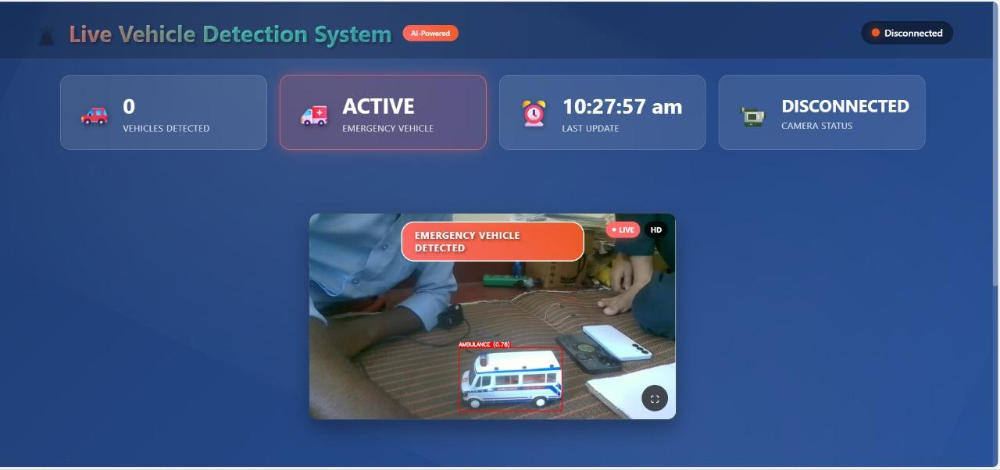

</td>
<td width="50%">

**Signal head with OLED, showing emergency priority on a lane:**

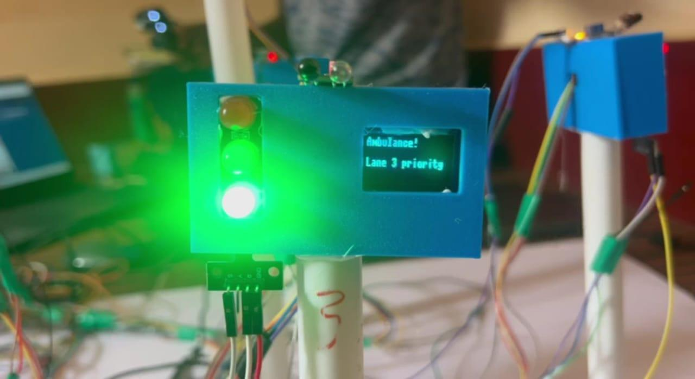

</td>
</tr>
<tr>
<td width="50%">

**Signal head showing normal-cycle countdown:**

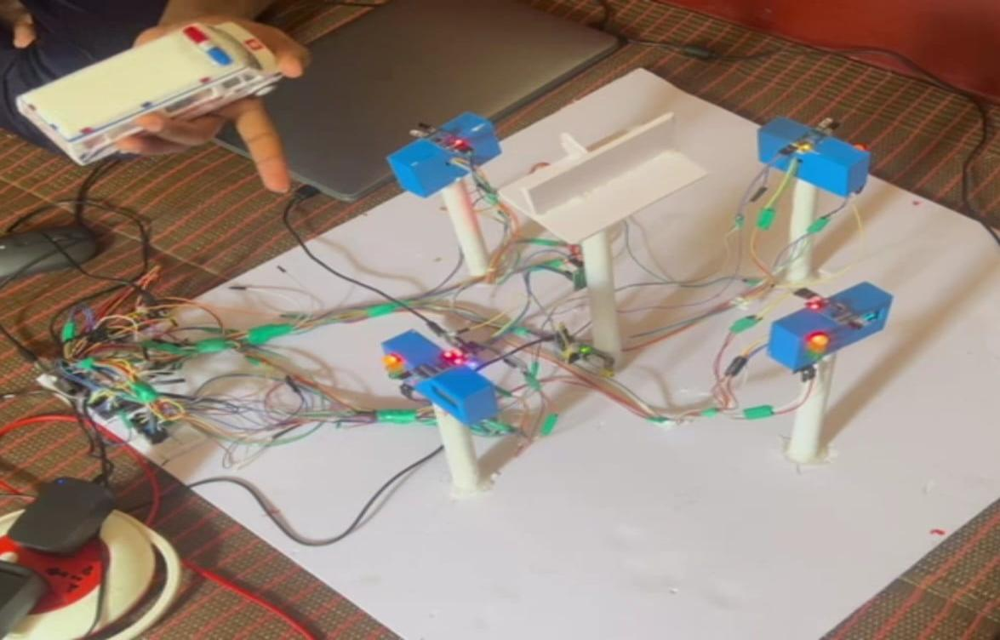

</td>
<td width="50%">

**Full 4-way bench prototype setup:**

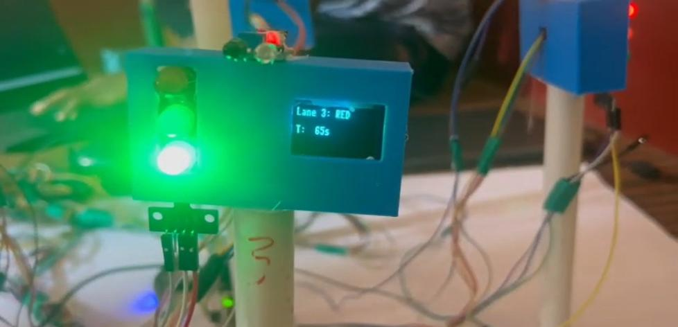

</td>
</tr>
</table>

## Installation

```bash
git clone <this-repo-url>
cd Traffic-Clearance-System-For-Emergency-Vehicles

# Server-side stack (broker + backend + dashboard)
cp backend/.env.example backend/.env
cp dashboard/.env.example dashboard/.env
docker compose up --build

# Create your first operator login
docker compose exec backend node database/seed.js admin "a-strong-password"

# Pi 4B detection (run on the actual Pi 4B, or locally for testing with --no-mqtt --show)
cd ai_model/inference && pip install -r ../requirements.txt
python detect.py --mqtt-host <server-ip> --lane 1 --weights ../model_weights/ambulance_yolov8n.pt
```

Pico WH and ESP8266 flashing instructions: [`firmware/pico_firmware/README.md`](firmware/pico_firmware/README.md)
and [`firmware/esp8266_firmware/README.md`](firmware/esp8266_firmware/README.md).

Full step-by-step bring-up order (what to power on and verify first): [`hardware/Wiring_Guide.md`](hardware/Wiring_Guide.md) §7.
Production/multi-intersection deployment: [`docs/Deployment_Guide.md`](docs/Deployment_Guide.md).

## Hardware Connections & Pin Mapping

| Signal | Lane 1 (N) | Lane 2 (E) | Lane 3 (S) | Lane 4 (W) |
|---|---|---|---|---|
| Green LED | GP2 | GP3 | GP4 | GP5 |
| Red LED | GP10 | GP11 | GP12 | GP13 |
| Yellow LED | GP14 | GP15 | GP16 | GP17 |
| IR sensor | GP6 | GP7 | GP8 | GP9 |

I2C0 (`GP0`=SDA, `GP1`=SCL) → PCA9548A mux (`0x70`) → 4× SSD1306 OLED (`0x3C`, one per mux channel 0–3).
`GP21` → ESP8266 buzzer trigger line.

Every pin above appears **exactly once** — fixing the original report's circuit diagram, which assigned
GP17 and GP15 twice each across different signal groups. This map is taken directly from the original
team's validated, working firmware rather than redrawn from the inconsistent diagram. Full wiring
rationale and bring-up order: [`hardware/Wiring_Guide.md`](hardware/Wiring_Guide.md). Full visual:
[`diagrams/Circuit_Diagram.svg`](diagrams/Circuit_Diagram.svg).

---

## API Documentation

Full reference with request/response examples: [`docs/API_Documentation.md`](docs/API_Documentation.md).

| Method | Path | Auth | Purpose |
|---|---|---|---|
| POST | `/api/auth/login` | — | Operator login → JWT |
| GET | `/api/events` | — | Recent emergency events |
| GET | `/api/lanes/cycles` | — | Signal-cycle history |
| GET | `/api/lanes/health` | — | Latest heartbeat per node |
| POST | `/api/override` | **JWT** | `force_red` / `clear_emergency`, audit-logged |

Plus a Socket.IO event stream (`emergencyEvent`, `laneStatus`, `emergencyCleared`, `systemHealth`) and 5
MQTT topics — see [`diagrams/Communication_Architecture.md`](diagrams/Communication_Architecture.md).

## Testing

| Suite | Status |
|---|---|
| [`testing/software_tests/test_detection_validator.py`](testing/software_tests/test_detection_validator.py) | **8/8 passing**, actually executed — caught and fixed a real multi-frame-confirmation counting bug during development |
| [`testing/software_tests/test_traffic_controller.py`](testing/software_tests/test_traffic_controller.py) | **7/7 passing**, actually executed against a simulated clock (no hardware needed) — caught and fixed a real bug where the emergency-hold minimum duration could be cut from 30s down to ~4s |
| [`testing/software_tests/test_backend_api.test.js`](testing/software_tests/test_backend_api.test.js) | Written, syntax-checked (`node --check`); not executed (no package-registry access in the build environment) — run `npm test` yourself |
| [`testing/hardware_tests/test_plan.md`](testing/hardware_tests/test_plan.md) | A full bench-validation checklist (power, fail-safe defaults, per-lane signals, emergency override timing, recovery) — template provided, not yet run against rebuilt hardware |
| [`simulations/wokwi/`](simulations/wokwi/) | Browser-runnable simulation of the Pico's signal-control logic, no physical hardware required |

Full breakdown of what's been run vs. what's ready-to-run: [`testing/software_tests/README.md`](testing/software_tests/README.md).

## Performance Metrics

These are the original team's bench-measured results on the **original** color/shape-detection +
Firebase-polling system — preserved as the documented baseline, not claimed as results for this
repository's YOLOv8/MQTT rebuild. See [Honest Project Status](#honest-project-status) and
[`testing/performance_reports/baseline_original_prototype.md`](testing/performance_reports/baseline_original_prototype.md)
for exactly what needs re-measuring and how.

| Metric | Original system (measured) |
|---|---|
| Ambulance detection rate (daylight / night) | 96.5% / 92.3% |
| False positive / false negative rate | 0.8% / 3.5% |
| Detection → signal change | 1.3 s average |
| Complete intersection clear time | 8–12 s |
| System uptime (30-day bench test) | 99.7% |
| Ambulance transit time reduction | 45% average |

## Future Enhancements

Carried over from the original report's roadmap, reorganized by what this rebuild's architecture is
already positioned to support vs. what would need new work:

**Builds directly on this architecture:**
- Multi-vehicle-type detection (fire truck, police) — extend the YOLOv8 class list and `ai_model/dataset/`.
- 5G / lower-latency comms — MQTT already abstracts the transport; swapping the link layer doesn't touch
  application code.
- Multi-intersection coordination — add an `intersection_id` field throughout (see
  [`docs/Deployment_Guide.md`](docs/Deployment_Guide.md) § Multi-intersection).

**Would need new subsystems:**
- LIDAR / thermal imaging sensor fusion for all-weather, 24/7 reliability.
- V2I (vehicle-to-infrastructure) protocols for equipped vehicles.
- Predictive traffic modeling (LSTM-based) ahead of congestion forming.
- Blockchain-backed immutable event logging (the current `audit_trail` is a conventional SQL log, not
  tamper-evident in the cryptographic sense).
- Differential privacy / homomorphic encryption for camera-feed privacy compliance.

---

## Project Demo

**Honest status: no recorded demo video exists in this revision.** Rather than link to nothing or stage
something misleading, here's what's actually available today and how to produce a real demo from it:

| What you can see right now | Where |
|---|---|
| Live detection running against a toy ambulance model, with a real confidence score overlaid | [`images/Dashboard_Screenshot.png`](images/Dashboard_Screenshot.png) — a genuine screenshot, not a mockup |
| The physical bench prototype mid-cycle, signal lit, OLED showing a live countdown | [`images/Prototype_System_Setup.png`](images/Prototype_System_Setup.png), [`images/Traffic_Light_Signal_Timer.png`](images/Traffic_Light_Signal_Timer.png) |
| The emergency override actually lighting a lane green with the OLED reading the priority lane | [`images/Traffic_Light_Emergency_Priority.png`](images/Traffic_Light_Emergency_Priority.png) |
| The corrected signal FSM running against a simulated clock, asserted against in code | `python testing/software_tests/test_traffic_controller.py` |
| The full intersection wired up in-browser, no hardware required | [`simulations/wokwi/`](simulations/wokwi/) — open in [wokwi.com](https://wokwi.com/) |

**To record a real demo video** once you have the hardware built (see
[`hardware/Wiring_Guide.md`](hardware/Wiring_Guide.md)): run `docker compose up`, start
`ai_model/inference/detect.py` pointed at a camera with a toy ambulance (or real footage) in frame, and
screen-record the dashboard alongside a phone camera on the physical signal heads. A demo that shows the
detection confidence score, the all-red clearance gap, and the OLED countdown in the same shot is far more
convincing than a polished edit that hides all three.

---

## Skills Demonstrated Through This Project

| Category | Specifics |
|---|---|
| **Embedded systems** | MicroPython on RP2040, Arduino C++ on ESP8266, GPIO/relay/I2C-mux interfacing, finite state machine design under safety constraints |
| **Computer vision / ML** | YOLOv8 fine-tuning workflow, OpenCV preprocessing, multi-stage detection validation, honest evaluation methodology (refusing to fabricate metrics without ground truth) |
| **IoT / networking** | MQTT pub/sub architecture, protocol selection (MQTT vs. REST vs. WebSocket) based on actual message characteristics, graceful-degradation design |
| **Backend engineering** | Node.js/Express REST API, Socket.IO real-time bridge, SQL schema design, JWT auth, rate limiting, audit logging |
| **Frontend engineering** | React 18 + Redux Toolkit state management, live WebSocket-driven UI, Chart.js data visualization, Tailwind CSS |
| **Hardware / circuit design** | GPIO pin allocation, relay/optocoupler isolation, power-budget calculation, BOM costing |
| **DevOps** | Docker multi-stage builds, Docker Compose orchestration, GitHub Actions CI |
| **Systems thinking / debugging** | Identified and fixed a real circuit-diagram pin conflict, a backward power-flow diagram error, and a missing safety interlock in a state machine; caught and fixed two real logic bugs by writing and running unit tests against simulated hardware — a detection-validator confirmation-counting bug, and an emergency-hold timing bug that could have cut a mandatory 30-second minimum down to ~4 seconds |
| **Technical writing** | Architecture docs, API reference, deployment guide, user manual — written for four different audiences (engineers, operators, deployers, recruiters) |

## Resume Impact

Suggested bullet points — phrased to be defensible in an interview, not just impressive at a glance:

- *Designed a 3-tier IoT architecture (edge AI / MQTT-REST-WebSocket / cloud backend) for an emergency
  -vehicle traffic pre-emption system, correcting 9 distinct design and circuit-diagram errors identified
  through critical review of an existing academic implementation.*
- *Implemented a 4-stage detection-validation pipeline (confidence, multi-frame confirmation, spatial
  zone, bounding-box plausibility) around a YOLOv8n model for on-device ambulance detection, with full
  unit test coverage that caught a real confirmation-counting logic bug before deployment.*
- *Designed a fail-safe embedded traffic-signal state machine in MicroPython with a deterministic
  all-red safety interlock; wrote a simulated-clock unit test suite that caught a real timing bug which
  would have cut the mandatory 30-second emergency-hold minimum down to roughly 4 seconds.*
- *Built a Node.js/Express/Socket.IO backend bridging MQTT IoT events to a live React dashboard, with
  JWT-authenticated manual override and a full audit trail for operator accountability.*

## Honest Project Status

This README and every module's own README distinguish three categories deliberately, rather than
presenting everything as uniformly "done":

| Status | What it means here | Examples |
|---|---|---|
| ✅ **Built and bench-tested by the original team** | Real hardware, real measurements, in `docs/Project_Report.pdf` | Timer-based signal cycling, OLED displays, Firebase-flag-triggered override, the performance figures in [Performance Metrics](#performance-metrics) |
| ✅ **Built and executed in this rebuild** | Code that was actually run and produced the stated result | `test_detection_validator.py` (8/8 passing) and `test_traffic_controller.py` (7/7 passing, including a regression test for a real emergency-hold timing bug); all SVG/Mermaid diagrams (rendered and visually verified); the BOM spreadsheet (formulas recalculated, zero errors) |
| ⚠️ **Built, syntax-checked, not executed end-to-end** | Real, complete code with no package-registry access in the environment it was written in | Node.js backend (`node --check` only); React dashboard (`esbuild` syntax-check only); ESP8266 firmware (not bench-flashed in this revision) |
| 📐 **Specification / scaffold, not a finished artifact** | Honest placeholders for things that would take real hardware/EDA time, not faked | PCB layout (`hardware/PCB_Design/` — no Gerbers exist); trained YOLOv8 weights (`ai_model/model_weights/` — no checkpoint exists); a labeled training dataset |

If you're evaluating this repository (as a recruiter, an interviewer, or a contributor), every module's
README states explicitly which of these four categories it falls into — search for "Honest status" or
"Known limitations" in any module's README for the specifics.

## Acknowledgements

This project was originally developed as a team effort:

- **Pavan Shetty H S** (4AI22EC078) — maintains this repository
- **Pratham J S** (4AI22EC083)
- **Sachin N** (4AI22EC092)
- **Thejomurthi A** (4AI22EC114)

Department of Electronics & Communication Engineering, Adichunchanagiri Institute of Technology
(affiliated to VTU, Belagavi), Chikkamagaluru, Karnataka — 2025-26.

With guidance from **Mrs. Linet D Souza** (Project Guide) and **Dr. Raghu Kumar B S** (Reviewer), and
support from Dr. Anil Kumar C (Project Coordinator) and Dr. M A Goutham (HOD, Dept. of ECE).

This repository is an independent, individually-maintained engineering rebuild of that team's original
submission, built for portfolio purposes — see [Honest Project Status](#honest-project-status) above for
exactly which parts are unchanged from the original team's work and which are new in this revision.

## References

Full bibliography (carried over from the original project report) plus the additional technology
references used in this rebuild: [`resources/references/REFERENCES.md`](resources/references/REFERENCES.md).

Datasheets and pinout references: [`resources/datasheets/`](resources/datasheets/).

## License

[MIT](LICENSE) — see the LICENSE file. The original academic project report
(`docs/Project_Report.pdf`) remains the intellectual work of its listed student authors and institution;
this repository's MIT license covers the rebuilt code, diagrams, and documentation in this revision.

---

<div align="center">

Issues and pull requests are welcome — see [`CONTRIBUTING.md`](CONTRIBUTING.md) for how this is organized
and [`CODE_OF_CONDUCT.md`](CODE_OF_CONDUCT.md) for community expectations.

</div>
