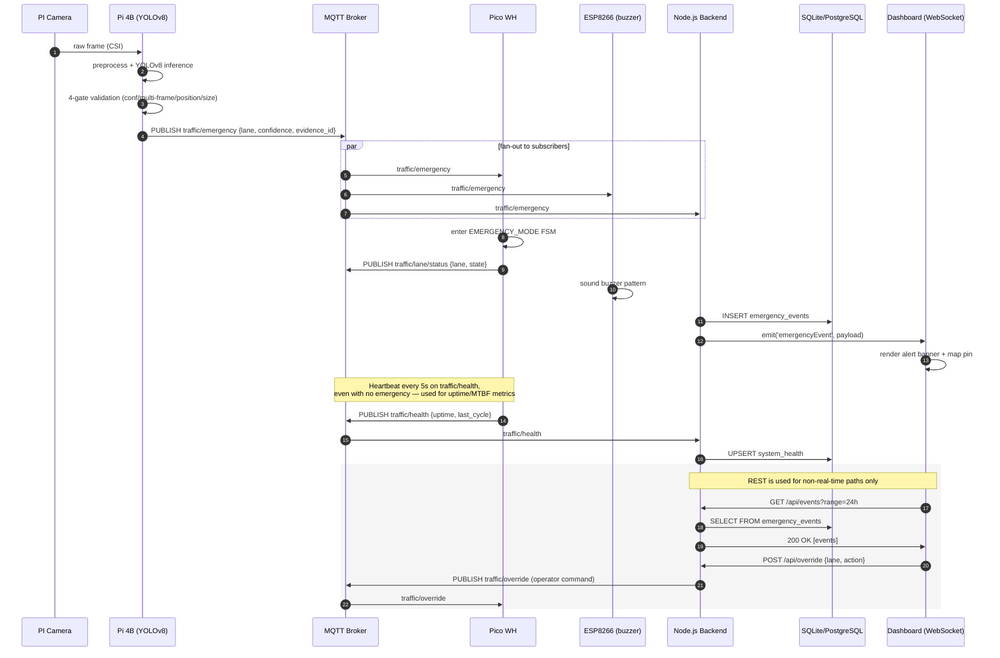

### Why MQTT + REST + WebSocket instead of REST-only

The original report routed every interaction — detection events, signal status, and dashboard
polling — through a single REST API. That works, but it has two costs that matter for a
time-critical system:

- REST is request/response: the dashboard would have had to **poll** for new emergency events, adding
  latency proportional to the poll interval (and wasting bandwidth between events).
- A REST call from a constrained microcontroller (Pico WH) blocks on a TCP handshake + HTTP overhead for
  every message, which is unnecessary cost for a small, frequent payload.

MQTT solves both: it's a persistent, lightweight publish/subscribe session, so the Pi 4B can publish a
detection event once and have it fan out instantly to the Pico, the ESP8266, and the backend with no
polling. REST is kept for what it's actually good at — configuration, history queries, and manual
override commands that are naturally request/response. WebSocket (via Socket.IO) is added purely for the
**dashboard's** live view, since browsers can't subscribe to MQTT directly without an extra bridge —
the backend performs that bridge.
