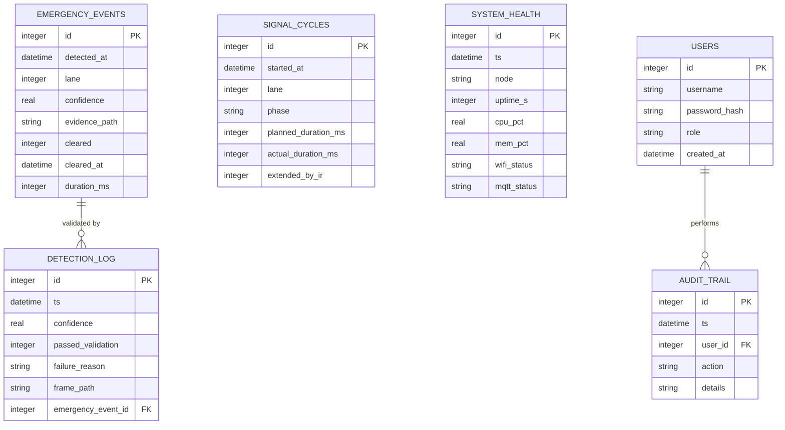

### Notes

- **SQLite** is used for the single-intersection pilot deployment described in this repository (zero
  config, file-based, trivially backed up). The schema is written in plain SQL
  (`backend/database/schema.sql`) with no SQLite-specific syntax, so migrating to **PostgreSQL** for a
  multi-intersection, city-scale deployment is a connection-string change, not a redesign.
- `DETECTION_LOG` intentionally records **every** inference pass, not just the ones that triggered an
  emergency — this is what makes it possible to compute false-positive/false-negative rates after the
  fact instead of only ever seeing confirmed detections.
- `AUDIT_TRAIL` exists because the original report flagged manual override as a feature but didn't
  specify any accountability trail for who issued it — added here to close that gap.
