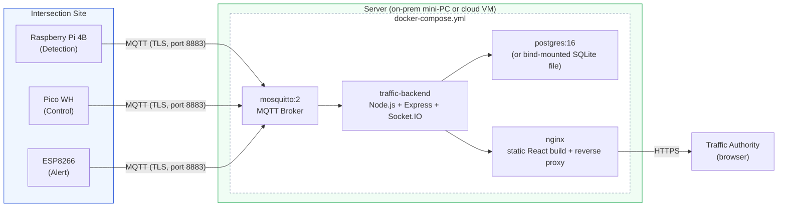

### Deployment notes

- A single `docker-compose.yml` (see `/docker-compose.yml`) brings up the broker, backend, database, and
  dashboard together for local development or a single-server pilot.
- Each intersection only needs outbound MQTT (TLS, port 8883) to the server — no inbound ports are
  opened on the edge hardware, reducing attack surface versus exposing a REST endpoint on each Pi.
- For a city-scale rollout, `Mosquitto` can be swapped for a managed broker (AWS IoT Core, HiveMQ Cloud)
  and Postgres for a managed instance (RDS/Cloud SQL) without changing the backend code — only
  connection configuration changes.
- See `docs/Deployment_Guide.md` for step-by-step setup, environment variables, and TLS certificate
  provisioning.
