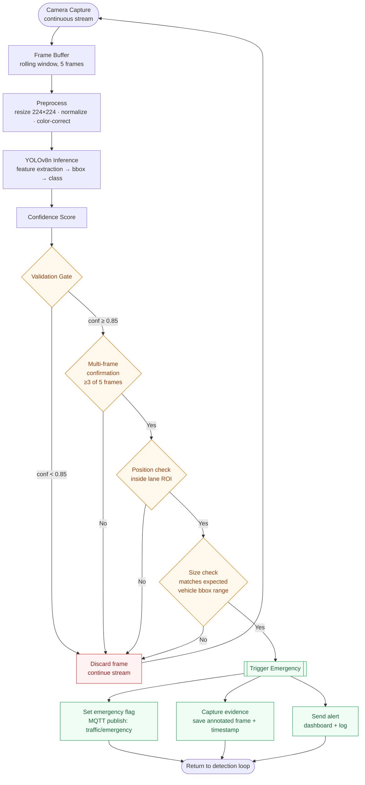

### What changed vs. the original report's Fig 2.5

The original flowchart (see `diagrams/originals/Emergency_Detection_Flow_v1_original.png`) had several
typos that suggested it was hand-traced rather than generated from the real pipeline (`FrameBubber`,
`Normlaize`, `Precpcesssing`). The logic itself was sound — multi-stage validation before triggering an
override is the right design — so this version keeps the same four-gate validation strategy
(confidence → multi-frame → position → size) but:

- Fixes the labelling/spelling throughout.
- Makes the **discard path explicit** — the original didn't show what happens when a check fails; here,
  a failed gate at any stage returns to the live stream instead of silently disappearing.
- Names the actual model (**YOLOv8n**, chosen for its balance of accuracy and edge-inference speed on
  the Raspberry Pi 4B) instead of an unspecified "ML Inference" block.
- Ties each output action to a concrete system effect (MQTT topic, evidence file, dashboard log) instead
  of generic boxes.
