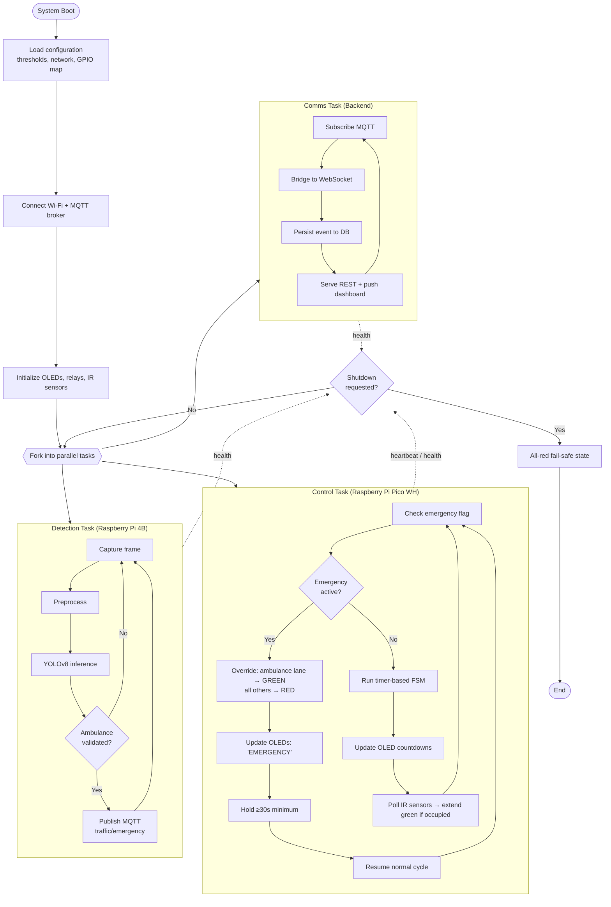

### What changed vs. the original report's Fig 2.4

The original "Autonomous System Operation Flow" diagram (see
`diagrams/originals/Main_System_Flow_v1_original.png`) mixed several swimlanes into a single column with
unlabeled arrows looping back into earlier boxes, making it hard to tell which steps ran in parallel and
which were sequential. This version keeps the same three concurrent responsibilities the original text
described (detection, control, communication) but represents them as explicit parallel lanes, names which
physical board executes each lane (Pi 4B vs. Pico WH vs. backend), and gives the shutdown path a defined
fail-safe end state (all signals red) rather than an ambiguous "Shutdown Sequence" box with no specified
output.
