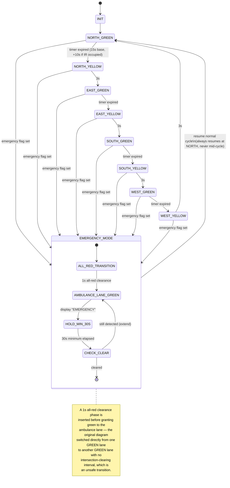

### What changed vs. the original report's Fig 2.6

The original state machine (see `diagrams/originals/Traffic_State_Machine_v1_original.png`) had two
issues worth calling out explicitly, since both are realistic
mistakes that a reviewer or interviewer is likely to probe:

1. **No all-red clearance interval before EMERGENCY_MODE.** The original diagram transitioned straight
   from whichever lane was GREEN into the ambulance lane's GREEN. Two perpendicular lanes both showing
   green for even a moment is a safety hazard. This revision inserts a brief mandatory all-red phase
   before granting the ambulance lane green, matching standard traffic-engineering practice for
   priority/pre-emption systems.
2. **Unreachable yellow states.** The original diagram's yellow boxes existed for North/East but the
   transitions for South/West collapsed straight from GREEN to the next lane's GREEN. This version gives
   every lane a symmetric GREEN → YELLOW → next-lane-GREEN path.

The 30-second minimum hold and "resume always at NORTH_GREEN" behavior from the original are kept, since
they reflect a deliberate (and reasonable) design choice for predictability after an override.
