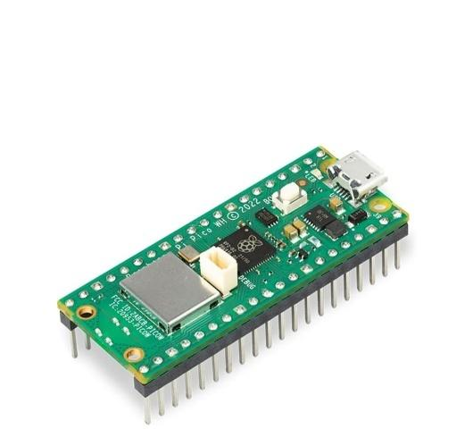
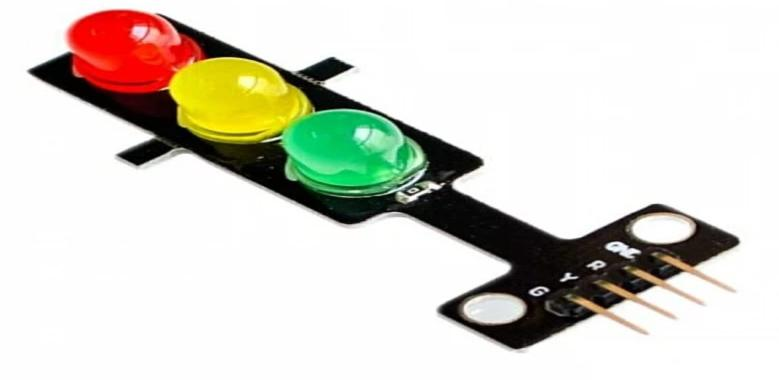
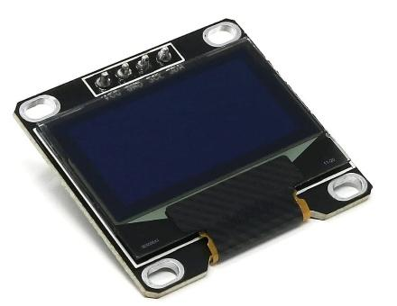
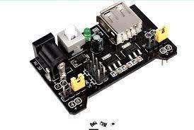

# hardware/

| File / folder | Contents |
|---|---|
| `BOM.xlsx` | Full bill of materials with quantities, approximate INR pricing, and sourcing notes |
| `Wiring_Guide.md` | Step-by-step build order, GPIO map, and bring-up sequence |
| `Circuit_Schematics/` | The corrected GPIO wiring diagram + the original report's diagram for comparison |
| `PCB_Design/` | Honest scope document — no PCB layout exists yet; this is the spec for one |

Start with `Wiring_Guide.md` if you're building the physical prototype; start with `BOM.xlsx` if you're
costing out a deployment.

## Component reference photos

Extracted from the original report's appendix (`docs/Project_Report.pdf`, Ch. 3) — genuine photos of the
actual parts used, not stock images:

<table>
<tr>
<td align="center" width="20%">

 
Raspberry Pi Pico WH

</td>
<td align="center" width="20%">

 
Camera module

</td>
<td align="center" width="20%">

 
RGB traffic signal LED

</td>
<td align="center" width="20%">

 
SSD1306 OLED

</td>
<td align="center" width="20%">

 
Regulated power supply

</td>
</tr>
</table>

Each corresponds to a row in `BOM.xlsx`. Official pinout diagrams for the two microcontrollers are in
[`resources/datasheets/`](../resources/datasheets/).

## A note on what's *not* in this BOM: the servo motor

The original report's hardware list (`docs/Project_Report.pdf`, Ch. 3) includes a **Servo Motor** and a
separate **ULN2003AN Stepper Motor Drive Module**, and a dedicated figure (Fig 2.2, preserved at
[`diagrams/originals/Servo_Block_Diagram_v1_original.png`](../diagrams/originals/Servo_Block_Diagram_v1_original.png))
showing an `ESP8266 → Servo Motor → Raspberry Pi Pico` flow.

Neither component appears in this revision's BOM, and that's a deliberate omission, not an oversight:

- The ULN2003A **is** kept (see the BOM row "ULN2003A Darlington Driver IC") — but in its role as a
  current-amplification driver for the LED arrays, which the original report's own text describes it as
  ("ULN2003A Darlington transistor array for current amplification"). That's a real, used component.
- The **servo motor** has no corresponding role anywhere else in the report: no other figure, hardware
  connection, or piece of firmware logic explains what it would physically move (a barrier arm? a
  rotating sign? a camera pan mechanism?), and the accompanying Fig 2.2 description is generic boilerplate
  that doesn't tie it to traffic control at all. Rather than inventing a plausible-sounding justification
  for a part with no clear function, it's left out of the corrected design. If your own deployment has an
  actual use for a servo (e.g., a physical "STOP" arm that swings out during an override), it's a
  reasonable future addition — just give it a real, documented job first.

